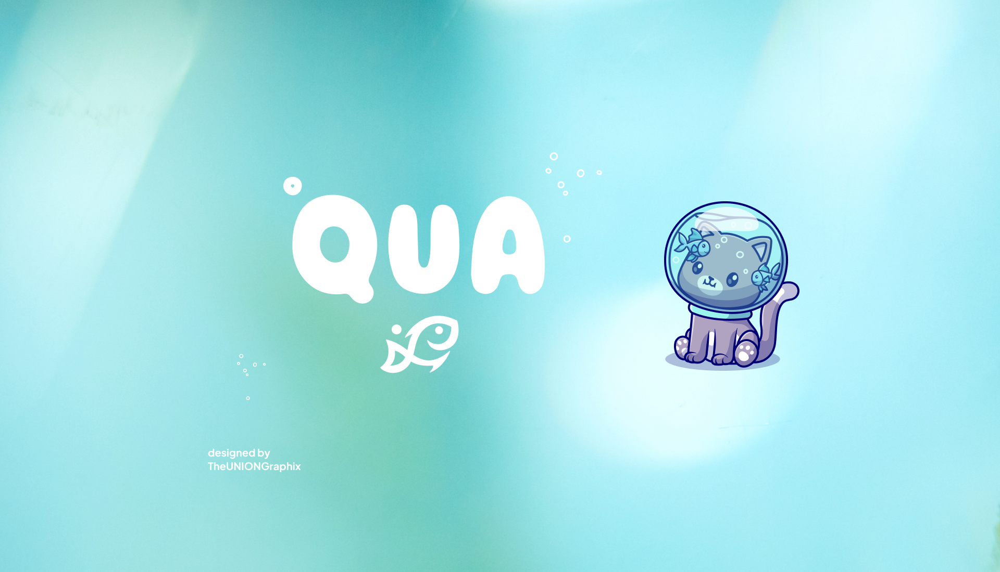
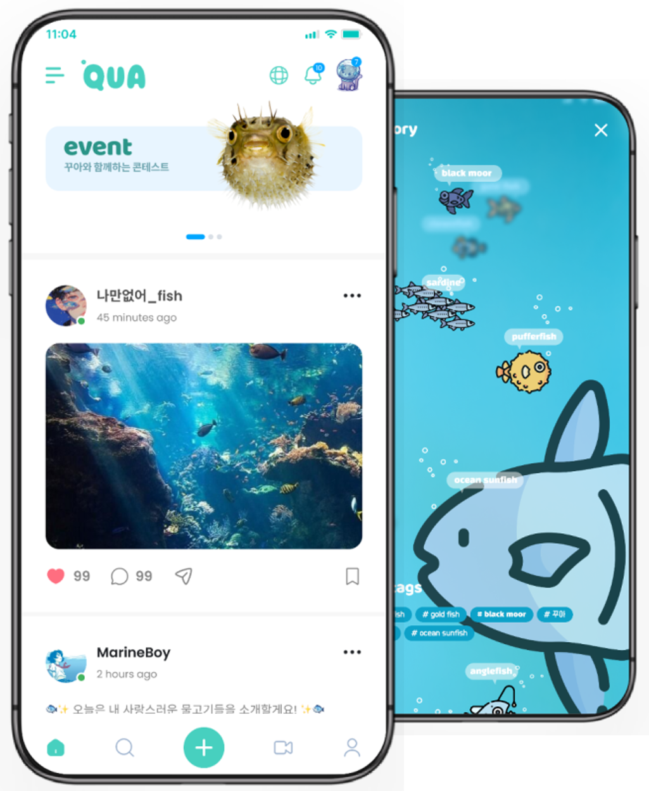
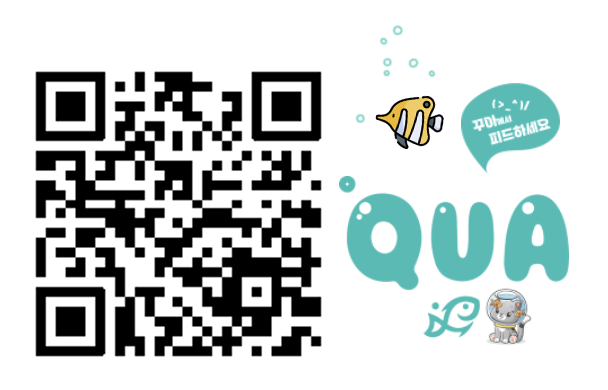
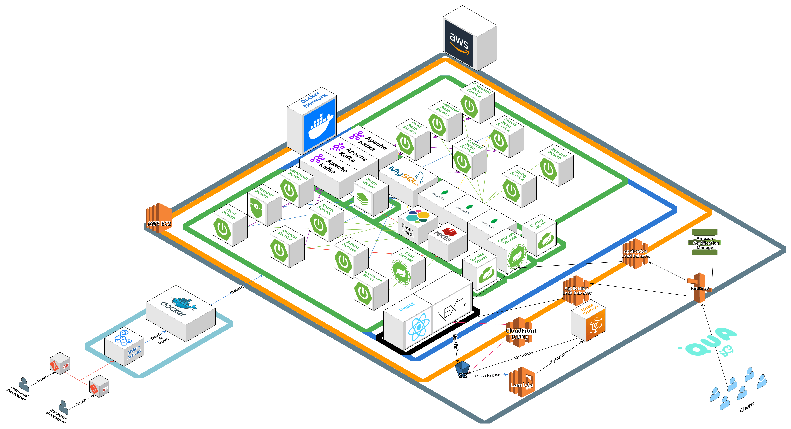
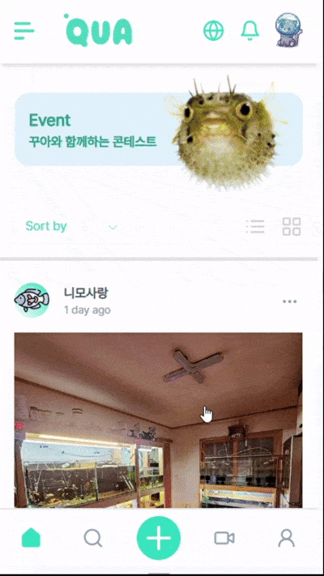
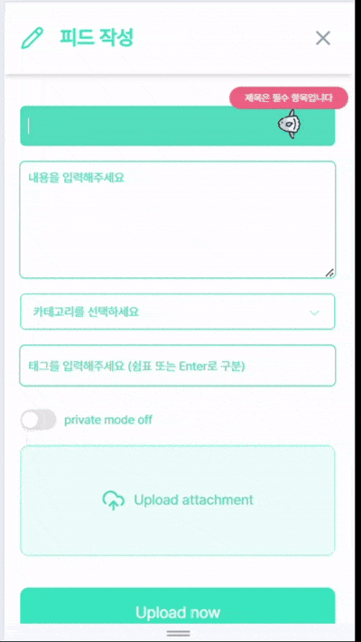
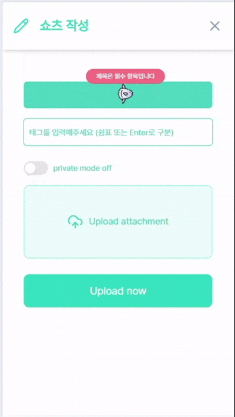
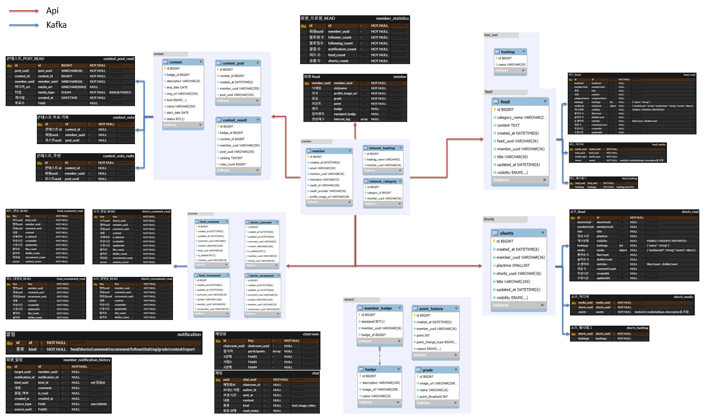
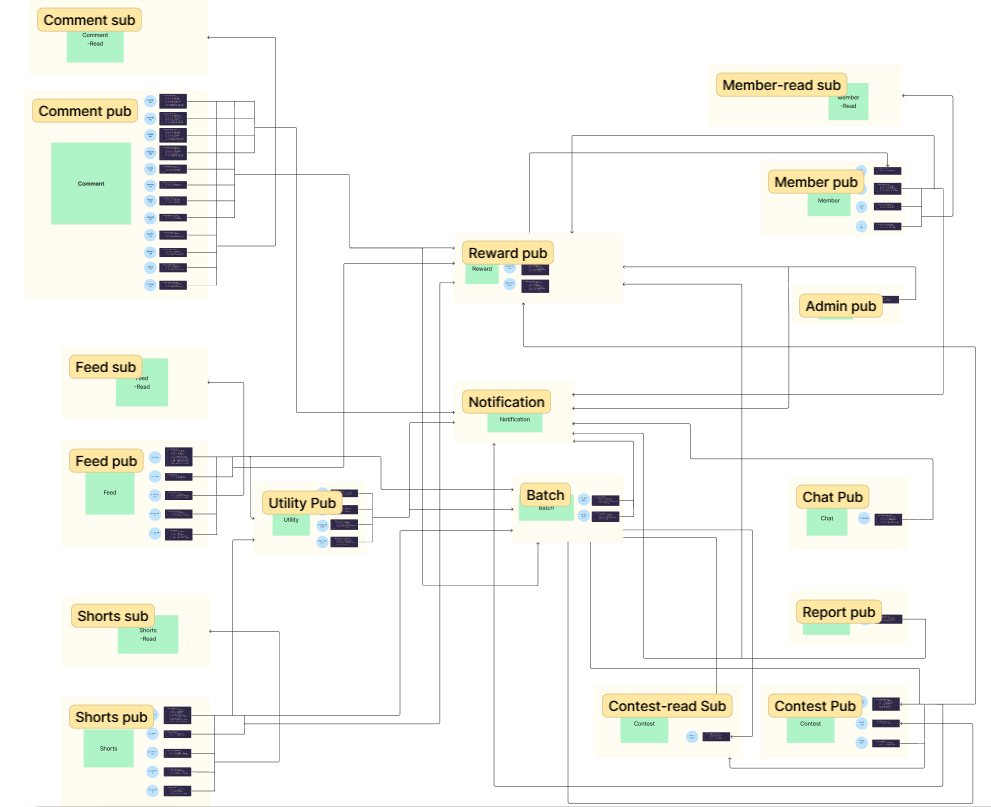

# 🐟 Qua
물고기와 함께하는 일상을 기록하고 소통할 수 있는 특별한 플랫폼, **반려어 SNS 프로젝트**<br>
반려어와 수족관에 대한 다양한 정보와 경험을 공유하는 커뮤니티 서비스입니다.

- **개발 기간** : 2024.10.08 ~ 2024.12.19  **(11주)**
- **플랫폼** : Web App
- **개발 인원** : 6명 <br><br>

<div align="center"> 
<table align="center">
    <tr>
      <td colspan="2" align="center" width="100%">
      </td></tr>
    <tr>
      <td width="40%" align="center">
      </td>
      <td width="60%" align="center">
      </td></tr>
</table> <br>
</div>

## 🔎 목차
<div align="center">

### <a href="#developers">🌟 팀원 구성</a>
### <a href="#techStack">🛠️ 기술 스택</a>
### <a href="#systemArchitecture">🌐 시스템 아키텍처</a>
### <a href="#skills">📲 기능 구성</a>
### <a href="#directories">📂 디렉터리 구조</a>
### <a href="#projectDeliverables">📦 프로젝트 산출물</a>
</div>
<br>

## 🌟 팀원 구성
<a name="developers"></a>

### 🌕 Frontend
<div align="center">
<table>
    <tr>
        <td width="25%" align="center"> <a href="https://github.com/eomhyunsik">
         <br> 🦞 엄현식 <br>(Frontend) </a> <br></td>
        <td width="25%" align="center"> <a href="https://github.com/oror-sine">
             <br> 🐡 홍정현 <br>(Frontend) </a> <br></td>
    </tr>
    <tr>
        <td width="160px">
            <sub>
                - 소셜 로그인 / 회원가입 <br>
                - 피드 폼, 쇼츠 폼, 콘테스트, 관심사 설정
            </sub>
        </td>
        <td width="160px">
        <sub>
          - 프로젝트 기획 <br>
          - 피드, 쇼츠, 댓글, 프로필, 유틸리티, 챗봇 <br>
          - 기술 공유, 업무관계관리
      </td>
    </tr>
</table>
</div>
<br>

### 🌑 Backend
<div align="center">
<table>
    <tr>
        <td width="25%" align="center"> <a href="https://github.com/gyudol">
             <br> 🐬 김규찬 <br>(Backend & DevOps) </a> <br></td>
        <td width="25%" align="center"> <a href="https://github.com/iqveou6">
             <br> 🐠 김나경 <br>(Backend) </a> <br></td>
        <td width="25%" align="center"> <a href="https://github.com/Cualone">
             <br> 🐳 이명준 <br>(Backend) </a> <br></td>
        <td width="25%" align="center"> <a href="https://github.com/SeongGwangJu">
             <br> 🐟 주성광 <br>(Backend & Leader) </a> <br></td>
    </tr>
    <tr>
      <td width="160px">
        <sub>
            - CI/CD 환경 및 인프라 구축 <br>
            - <strong>Service</strong>: 피드 (CQRS) | 쇼츠 (CQRS) | Eureka <br> 
            - 스트리밍 데이터 변환 및 송출 자동화 <br>
            - Elasticsearch 활용한 <strong>검색 & 추천</strong>
        </sub>
      </td>
      <td width="160px">
        <sub>
          - <strong>Service</strong>: 댓글 (CQRS) | 알림 (SSE) | 챗봇 <br>
          - OpenAI 활용한 챗봇
        </sub>
      </td>
      <td width="160px">
        <sub>
            - <strong>Service</strong>: 콘테스트 (CQRS) | 유틸리티 | Batch <br>
            - Google Vision API 활용한 콘테스트 이미지 필터링 
        </sub>
      </td>
      <td width="160px">
        <sub>
          - <strong>Service</strong>: 회원 (CQRS) | 리워드 | 채팅 (Webflux) | Admin | Gateway (Webflux) | Config
        </sub>
        </sub>
      </td>
    </tr>
</table>

</div>


## 🛠️ 기술 스택
<a name="techStack"></a>
### 🌕 Frontend

<div align="center">

<br>


<br>


</div>

- **Language |** JavaScript, TypeScript 5.5.4
- **Runtime Environment |** Node.js 22.11.0
- **Framework |** Next.js 14.2.18 (React 18.3.1), Tailwind CSS 3.4.1
- **Library |** React Query 5.62.0, shadcn/ui 2.1.6, Swiper 11.1.15
- **IDE |** Visual Studio Code 1.93.1

### 🌑 Backend
<div align="center">


<br>


<br>


</div>

- **Language |** Java 17
- **Framework |** Spring Boot 3.3.5
- **Library |** Spring Data JPA, Querydsl 5.0.0
- **Database |** MySQL 9.1.0, 
- **IDE |** IntelliJ IDEA 2024.2 (Ultimate Edition), Visual Studio Code 1.93.1
- **Build Tool |** Gradle 8.8.0

### DevOps
<div align="center">


<br>


</div>

### Collaboration
<div align="center">


</div>
<br>

## 🌐 시스템 아키텍처
<a name="systemArchitecture"></a>
<div align="center"> 


</div>
<br>

## 📲 기능 구성
<a name="skills"></a>
<div align="center"> 
<table>
  <tbody align="center"> 
    <tr> <th style="text-align: center"> Login </th> <th style="text-align: center"> Feed Create </th> 
    <th style="text-align: center"> Shorts Create </th> <th style="text-align: center"> Search </th> </tr>
    <tr> <td width="25%"></td> 
        <td width="25%"></td> 
        <td width="25%"></td> 
        <td width="25%"></td> </tr>
  </tbody>
  <tbody align="center"> 
    <tr> <th style="text-align: center"> (임시) </th> <th style="text-align: center"> Feed View </th> 
    <th style="text-align: center"> Shorts View </th> <th style="text-align: center"> (임시) </th> </tr>
    <tr> <td width="25%"></td> 
  </tbody>
</table>
</div>
<br>

## 📂 디렉터리 구조
<a name="directories"></a>
### 🌕 Frontend
<details align="left">
  <summary>
    <strong>qua-client</strong>
  </summary>

  ```

  ```
</details>

### 🌑 Backend
<details align="left">
  <summary>
    자세히
  </summary>

  ```

  ```
</details>
<br>

## 📦 프로젝트 산출물
<a name="projectDeliverables"></a>

<h3>🗄️ ERD</h3>
<div align="center"> 


</div>

<h3>💨 Kafka Event Flow</h3>
<div align="center"> 


</div>

<h3>✅ Swagger API Docs</h3>
<details>
  <summary>
    자세히
  </summary>
    
</details>

<h3><a href="https://docs.google.com/spreadsheets/d/1CdCDOPiE4GA5urwCMLrX0c7LAO8PddCFb4XHhNKpIgc/edit?gid=118836952#gid=118836952" target="_blank">📅 WBS</a></h3>

<h3><a href="https://docs.google.com/spreadsheets/d/1CdCDOPiE4GA5urwCMLrX0c7LAO8PddCFb4XHhNKpIgc/edit?gid=1474673446#gid=1474673446" target="_blank">📋 요구사항 정의서</a></h3>

<h3><a href="https://docs.google.com/spreadsheets/d/1CdCDOPiE4GA5urwCMLrX0c7LAO8PddCFb4XHhNKpIgc/edit?gid=1680415821#gid=1680415821" target="_blank">📡 API 명세서</a></h3>
